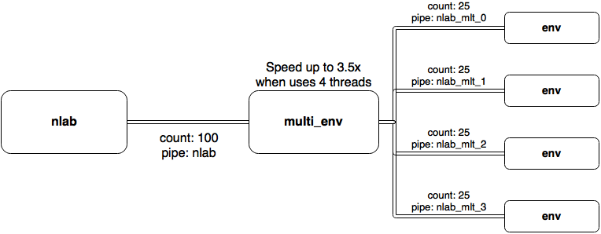
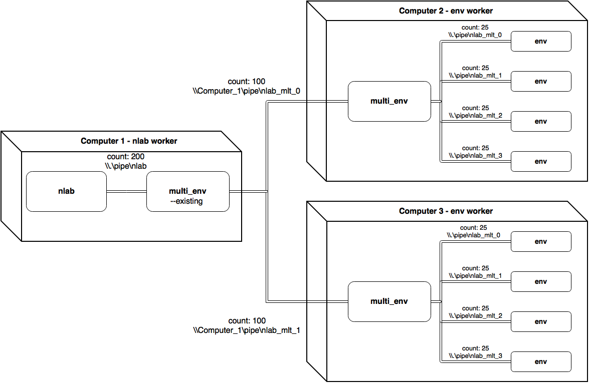

# Multiplexer utility for nlab

### Requirements
 * [pynlab](https://github.com/Apostol3/pynlab) >= 0.3.2

### Usage

````
multi_env.py [-h] [-I name] [-O name] [-e] N exec

positional arguments:
  N                     count of environments to start
  exec                  command to execute environments

optional arguments:
  -h, --help            show help message and exit
  -I name, --envs_uri name
                        enviroments URI in format
                        '[tcp|winpipe]://hostname(/pipe_name|:port)' (default:
                        tcp://127.0.0.1:15005
  -O name, --nlab_uri name
                        nlab URI in format
                        '[tcp|winpipe]://hostname(/pipe_name|:port)' (default:
                        tcp://127.0.0.1:5005
  -e, --existing        connect to existing environments and do not spawn them
````

### Rough usage diagrams
#### On one machine:

#### On multiple machines via LAN:
